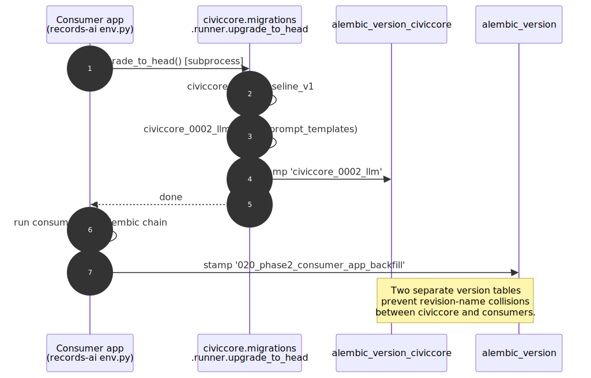

# CivicCore

Shared platform package for the
[CivicSuite](https://github.com/CivicSuite/civicsuite) open-source
municipal operations suite.

## What this is

CivicCore is the Python package every CivicSuite module depends on for
shared platform plumbing. **What ships today:** the migration runner plus
`civiccore_0001_baseline_v1` shared-schema baseline, a shared SQLAlchemy
declarative `Base`, the `civiccore.llm` module, hash-chained audit
primitives, source/provenance metadata contracts, offline import/export
manifest schemas, static export-bundle helpers, local city profile
configuration, small auth helpers for downstream FastAPI services,
including mixed public/staff routes that should stay anonymous by
default while unlocking privileged results for authorized callers,
browser-evidence verification helpers for current-facing release pages,
small shared search helpers for deterministic text matching, generic
permission-aware access checks, hybrid ranking fusion, and local-first connector import helpers for
agenda-platform payload normalization with actionable error contracts and
source provenance, storage-neutral live connector sync retry/circuit-breaker
primitives with actionable operator health copy and shared source-list status
projection, connector delta request
planning, reusable mock-city proof contracts for vendor, municipal IdP, and
backup-retention readiness, shared ingest contracts for connector discovery/fetch
records and cited-source validation, plus shared notice deadline planning
and publication compliance helpers with actionable warning codes, plus shared
cron schedule validation helpers for module background jobs.

**Still planned extraction targets (placeholder packages exist; not yet
implemented today):** `civiccore.catalog`, `civiccore.exemptions`
(50-state public-records exemption engine),
`civiccore.scaffold`. `civiccore.ingest` now ships reusable
discovery/fetch contracts plus cited-source validation helpers, but not a
full document ingestion pipeline, parser stack, or worker runtime.
`civiccore.onboarding` now ships storage-neutral
profile interview helpers, but not a web onboarding UI or persistence
router. `civiccore.search` now ships normalization and
fusion helpers, but not a full search engine or indexer.
`civiccore.notifications` now ships notice deadline and compliance
helpers, but not delivery queues or outbound notification orchestration.
`civiccore.verification` now ships the first release-evidence helper
surface, while sovereignty verification remains future work.
`civiccore.connectors` now also ships shared local-payload import
normalization helpers, live-sync retry/circuit-breaker primitives, and source-list
status projection helpers for supported agenda platforms, while
`civiccore.security` now ships shared connector-host validation,
startup config validation, and encrypted JSON envelope helpers for secret-bearing config.
`civiccore.scheduling` now ships storage-neutral cron validation and next-run
helpers, but not a scheduler runtime or task queue. Credential
orchestration, vendor-specific network adapters, and vendor write-back remain unshipped.
`civiccore.release_provenance` now uses the attestation trust model for release
verification: Git tags are treated as release pointers, while
`release-attestation.json` plus its Sigstore/cosign bundle are the verifiable
trust artifacts. The exact workflow identity is pinned per repo and per tag;
org-wide wildcard identities are not accepted.
Unshipped
namespaces are reserved for future Phase work and must not be relied on
by downstream modules until they ship.

## Status

**v0.22.1 is staged as the first attested baseline release.** This line adds
the canonical Sigstore release-provenance helper, versioned attestation schema,
fixture-driven gate, and tag-driven release workflow that signs and verifies
`release-attestation.json` before publication. It also carries the shared
connector source-list status projection that combines circuit health, active
failure counts, pause state, actionable operator copy, and next-run calculation
for module workspaces on top of shared cron schedule validation helpers for
module background jobs on top of shared
startup config validation helpers for placeholder detection, CSV env parsing,
generic secret checks, Fernet key validation, and common-password rejection,
on top of shared vendor delta request planning plus reusable no-network
mock-city proof contracts for agenda vendors, municipal OIDC, and backup
retention/off-host storage, on top of shared live connector sync retry/circuit-breaker primitives,
including run-result normalization, operator health copy, retry delay policy, and async HTTP retry,
on top of shared persisted audit-log hash and verification helpers for
database-backed module audit rows on top of shared trusted-header auth config
loading and proxy-source enforcement helpers on top of shipped
trusted-header auth helpers on top of shipped
`civiccore.ingest` discovery/fetch and cited-source validation contracts on top of shipped
`civiccore.security` connector host-validation, startup config validation, and encrypted-config helpers on top of shipped
`civiccore.onboarding` profile interview helpers on top of shipped
`civiccore.notifications` notice deadline planning and publication
compliance helpers on top of the shipped `civiccore.connectors`
local-first import helpers, the shipped `civiccore.search` helper
surface for deterministic text matching, permission-aware access checks,
and reciprocal-rank-fusion, the
shipped `civiccore.verification` release-evidence helpers, the shipped
`civiccore.auth` optional bearer resolver for mixed public/staff
endpoints, and the shared audit, provenance, manifest, export-bundle,
and city profile primitives needed for the first production-depth
CivicSuite workflows.
`v0.2.0` shipped the `civiccore.llm` module:
provider abstraction (Ollama / OpenAI / Anthropic), prompt template engine
with a 3-step override resolver, model registry service + admin router,
context utilities with prompt-injection defense, and a Pydantic-validated
structured-output helper. `v0.1.0` was the Phase 1 baseline (migration
runner, idempotent guards, and the `civiccore_0001_baseline_v1`
shared-schema baseline extracted from CivicRecords AI).

## Architecture

### Shipped vs placeholder



### Migration order (consumer chain)



### LLM provider abstraction



## Install

From the current GitHub release wheel (`v0.22.1`, once published):

```bash
pip install https://github.com/CivicSuite/civiccore/releases/download/v0.22.1/civiccore-0.22.1-py3-none-any.whl
```

Each GitHub release also publishes `SHA256SUMS.txt` alongside the wheel and
sdist. Verify the checksum before promoting a release artifact into a downstream
module or internal package mirror.

### Release Provenance

CivicCore now carries the canonical CivicSuite release-provenance gate in
`civiccore.release_provenance`. The gate exists because GitHub release pages can
show the target commit as "Verified" even when the release tag is lightweight or
the annotated tag object is unsigned. Treat the release-page badge as a commit
signal only; use `scripts/verify-release-provenance.py` and
`docs/ops/release-signing.md` for release-tag provenance.

The current public `v0.22.0` release is in the Tier 1 correction window because
it predates the Sigstore attestation baseline. Treat `v0.22.1` as the staged
baseline release candidate until the release workflow publishes its attestation
and bundle. Do not republish, mirror, or rely on `v0.22.0` as the corrected
provenance baseline until the Tier 1 correction is complete.

For development from a clone:

```bash
git clone https://github.com/CivicSuite/civiccore.git
cd civiccore
pip install -e .[dev]
```

PyPI publication can come later; CivicCore is distributed as versioned
GitHub release artifacts so CivicRecords AI can stop depending on a Git SHA pin.
The tag-driven release workflow runs `scripts/verify-release.sh` before
publishing so the shipped artifact has already passed pytest, ruff,
docs/version checks, a local build, and a clean-virtualenv wheel-install smoke
test.

## LLM providers

CivicCore exposes a pluggable LLM provider abstraction for downstream apps. Three providers ship built-in:

```python
from civiccore.llm.providers import (
    LLMProvider,         # ABC
    register_provider,   # decorator for adding new providers
    get_provider,        # construct a provider by name
    list_providers,      # introspection
    OllamaProvider,
    OpenAIProvider,
    AnthropicProvider,
)

# Built-in usage
provider = get_provider("ollama", base_url="http://localhost:11434")
text = await provider.generate(system_prompt="...", user_content="...")
```

Optional cloud-provider SDKs are needed only if you instantiate the corresponding provider:

```bash
# Direct install (works today, including GitHub wheel installs):
pip install openai      # required for OpenAIProvider
pip install anthropic   # required for AnthropicProvider

# Extras shorthand (works once civiccore is published to PyPI):
pip install civiccore[openai]
pip install civiccore[anthropic]
```

Ollama needs no extra (uses httpx, already a base dependency).

Third-party providers register via the public decorator without modifying civiccore source:

```python
from civiccore.llm.providers import LLMProvider, register_provider

@register_provider("my_provider")
class MyProvider(LLMProvider):
    ...
```

## LLM templates

CivicCore exposes a prompt-template rendering and override-resolution layer for downstream apps.

```python
from civiccore.llm.templates import (
    PromptTemplate,             # ORM
    PromptTemplateCreate,       # Pydantic schemas
    PromptTemplateRead,
    RenderedPrompt,             # render() result dataclass
    render_template,            # string.Template renderer
    resolve_template,           # async DB resolver (3-step: app DB → code-level → civiccore default)
    CIVICCORE_DEFAULT_APP,      # "civiccore" namespace constant
    PromptTemplateError,        # exceptions
    PromptTemplateNotFoundError,
    PromptTemplateRenderError,
)
```

### Resolution order

`resolve_template(session, template_name=..., consumer_app=...)` returns the active `PromptTemplate` row using:

1. **App DB override** — `consumer_app=<requesting app>`, `is_override=True`, `is_active=True`, highest `version`.
2. **App code-level override** — in-memory `OVERRIDE_REGISTRY` populated via `register_template_override` (per ADR-0004 §7). DB overrides win over code overrides so operators retain production hot-fix capability.
3. **CivicCore default** — `consumer_app="civiccore"`, `is_override=False`, `is_active=True`, highest `version`.
4. Otherwise raises `PromptTemplateNotFoundError`.

Callers passing `consumer_app="civiccore"` skip both override steps (1 and 2) and resolve directly to the civiccore default.

### Rendering

`render_template(template, {"key": "value", ...})` substitutes `string.Template` placeholders (`$key` or `${key}`). Missing variables raise `PromptTemplateRenderError` naming the missing key.

## LLM context utilities and structured output

CivicCore exposes context-budgeting and structured-output helpers at the package root:

```python
from civiccore.llm import (
    TokenBudget, ContextBlock,
    estimate_tokens, count_tokens, sanitize_for_llm,
    assemble_context, blocks_to_prompt, DEFAULT_CONTEXT_WINDOW,
    StructuredOutput, StructuredOutputFailure,
)

# Token-budgeted prompt assembly with prompt-injection defense
blocks = assemble_context(
    system_prompt="You are a helpful assistant.",
    chunks=[document_text],
    max_context_tokens=4096,
)
prompt = blocks_to_prompt(blocks)

# Pydantic-validated structured output with retry-on-malformed
class ExtractedFields(BaseModel):
    name: str
    confidence: float

result = await StructuredOutput(ExtractedFields).generate(
    provider=get_provider("ollama"),
    system_prompt="Extract fields from the document.",
    user_content=document_text,
    max_attempts=3,
)
```

Per ADR-0004: token counting is context-window math; no cost tracking, no spend limits.

## Audit, provenance, manifests, exports, and city profiles

The current CivicCore development line adds storage-neutral primitives
for production-depth municipal workflows:

```python
from civiccore import (
    AuditActor, AuditSubject, AuditHashChain,
    PersistedAuditLogEntry, compute_persisted_audit_hash,
    verify_persisted_audit_chain,
    SourceReference, SourceKind, CitationTarget, ProvenanceBundle,
    ImportManifest, ExportManifest, ManifestFile, validate_manifest,
    ExportBundle, BundleFile, write_manifest, build_sha256sums, validate_bundle,
    CityProfile, load_city_profile,
)

chain = AuditHashChain()
chain.record_event(
    actor=AuditActor(actor_id="clerk-1", actor_type="staff"),
    action="packet_exported",
    subject=AuditSubject(subject_id="meeting-42", subject_type="meeting"),
    source_module="civicclerk",
)
assert chain.verify()

entry_hash = compute_persisted_audit_hash(
    previous_hash="0" * 64,
    timestamp="2026-05-01T12:00:00+00:00",
    actor_id="records-admin",
    action="request_created",
    details={"request_id": "RR-1001"},
)
assert verify_persisted_audit_chain([
    PersistedAuditLogEntry(
        previous_hash="0" * 64,
        entry_hash=entry_hash,
        timestamp="2026-05-01T12:00:00+00:00",
        actor_id="records-admin",
        action="request_created",
        details={"request_id": "RR-1001"},
    )
])[0]
```

These APIs are deliberately offline-first. They do not provide JWT
issuance, SSO, user directories, credential storage, vendor-specific network
adapters, document ingestion, search indexing, legal determinations, or vendor
write-back.

## Live connector sync primitives

CivicCore ships the storage-neutral pieces of the CivicRecords AI sync pattern
so every CivicSuite module can share one retry and circuit-breaker contract
without inheriting product-specific tables, credentials, or vendor adapters.

```python
from civiccore.connectors import (
    SyncCircuitState,
    SyncRunResult,
    apply_sync_run_result,
    build_sync_operator_status,
    build_sync_source_status,
)

state = SyncCircuitState(connector="legistar", source_name="Legistar production")
state = apply_sync_run_result(
    state,
    SyncRunResult(records_discovered=1, records_succeeded=0, records_failed=1),
)
status = build_sync_operator_status(state)
assert status.public_dict()["health_status"] == "degraded"
source_status = build_sync_source_status(state, sync_schedule="*/15 * * * *")
assert source_status.public_dict()["active_failure_count"] == 0
```

The shared circuit opens after five consecutive full-run failures by default,
or after two failures when the source is in a configured grace period. Modules
still own their ORM rows, scheduler, credential store, vendor-specific fetch
logic, and UI, but they should use this shared state machine, operator copy, and
source-list projection instead of reimplementing it.

## Auth helper

`civiccore.auth` now exposes small auth helpers for downstream FastAPI
services that need to protect non-public internal endpoints or support
mixed public/staff routes without taking on a full first-party
identity-provider dependency. That surface now includes shared
trusted-header config loading and proxy-source enforcement helpers in
addition to bearer-token and trusted-header role checks.

```python
from fastapi import Depends
from fastapi.security import HTTPBearer

from civiccore.auth import (
    authorize_bearer_roles,
    authorize_trusted_header_roles,
    resolve_optional_bearer_roles,
)

bearer = HTTPBearer(auto_error=False)

def read_workpaper(credentials = Depends(bearer)) -> dict[str, str]:
    authorize_bearer_roles(
        credentials,
        service_name="CivicBudget",
        feature_name="persisted workpaper retrieval",
        token_roles_env_var="CIVICBUDGET_AUTH_TOKEN_ROLES",
        allowed_roles={"workpaper_reader", "budget_admin"},
    )
    return {"status": "ok"}


def search_archive(credentials = Depends(bearer)) -> dict[str, bool]:
    principal = resolve_optional_bearer_roles(
        credentials,
        service_name="CivicClerk",
        feature_name="archive search staff access",
        token_roles_env_var="CIVICCLERK_AUTH_TOKEN_ROLES",
        allowed_roles={"archive_reader", "clerk_admin", "city_attorney"},
    )
    return {"include_closed": principal is not None}


def require_proxy_assertion(request) -> dict[str, str]:
    principal = authorize_trusted_header_roles(
        request.headers,
        service_name="CivicClerk",
        feature_name="staff workflow access",
        principal_header_name="X-Forwarded-Email",
        roles_header_name="X-Forwarded-Roles",
        allowed_roles={"clerk_admin", "meeting_editor"},
        provider_name="Entra ID proxy",
    )
    return {"subject": principal.subject or "unknown"}
```

Set `CIVICBUDGET_AUTH_TOKEN_ROLES` to a JSON object that maps bearer
tokens to role strings or role lists:

```json
{
  "demo-reader-token": ["workpaper_reader"],
  "budget-admin-token": "workpaper_reader,budget_admin"
}
```

If the bearer-token config is missing or malformed, CivicCore raises an
actionable `503`; missing or invalid bearer headers return `401`; tokens
without an allowed role return `403`. Trusted-header helpers return
actionable `401` and `403` responses when the proxy assertion is missing,
malformed, or underprivileged. The optional resolvers return `None` for
anonymous callers, which lets public endpoints stay public until a caller
actually presents a bearer token or arrives through a trusted proxy.

## Onboarding helper

`civiccore.onboarding` now ships shared storage-neutral helpers for
interview-style city-profile onboarding flows:

```python
from civiccore.onboarding import (
    DEFAULT_PROFILE_FIELDS,
    compute_onboarding_status,
    next_profile_prompt,
    parse_profile_answer,
)

parsed = parse_profile_answer("has_dedicated_it", "yes")
status = compute_onboarding_status({"city_name": "Sampleville"})
progress = next_profile_prompt(
    {"city_name": "Sampleville"},
    skipped_fields=("state",),
)
assert parsed is True
assert status == "in_progress"
assert progress.next_field == "county"
```

This ships the field order, skip-aware next-question selection, text
trimming, and yes/no normalization contract. Full web onboarding flows,
router integration, and persistence orchestration remain future work.

## Scheduling helper

`civiccore.scheduling` exposes the shared cron expression contract used by
module background jobs. Modules keep their own Celery/worker/runtime wiring,
but should reuse this validation so one-minute accidental or adversarial
schedules are blocked consistently across CivicSuite.

```python
from civiccore.scheduling import compute_next_sync_at, validate_cron_expression

validate_cron_expression("*/5 * * * *")
next_run = compute_next_sync_at("0 2 * * *", last_sync_at=None)
```

## Verification helper

`civiccore.verification` now ships a small browser-evidence helper for
current-facing release pages. It binds a release screenshot manifest to
the normalized content hash of a rendered source file, which keeps
browser QA evidence honest across Windows and Linux checkouts.

```python
from pathlib import Path

from civiccore.verification import validate_release_browser_evidence

result = validate_release_browser_evidence(
    repo_root=Path("."),
    manifest_path=Path("docs/browser-qa/release-evidence.json"),
    expected_version="0.1.2",
)
print(result.reviewed_at)
```

## Public API surface

`civiccore.llm` exposes a single import surface for downstream apps:

```python
from civiccore.llm import (
    # Providers
    LLMProvider, register_provider, get_provider, list_providers,
    OllamaProvider, OpenAIProvider, AnthropicProvider,
    # Templates
    PromptTemplate, PromptTemplateCreate, PromptTemplateRead,
    RenderedPrompt, render_template, resolve_template,
    CIVICCORE_DEFAULT_APP, PromptTemplateError,
    PromptTemplateNotFoundError, PromptTemplateRenderError,
    # Model registry
    ModelRegistry, ModelRegistryCreate, ModelRegistryRead, ModelRegistryUpdate,
    model_registry_router, MissingModelError, ModelRegistryServiceError,
    get_active_model, require_active_model, get_active_model_context_window,
    # Context utilities
    TokenBudget, ContextBlock, estimate_tokens, count_tokens, sanitize_for_llm,
    assemble_context, blocks_to_prompt, DEFAULT_CONTEXT_WINDOW,
    # Structured output
    StructuredOutput, StructuredOutputFailure, DEFAULT_MAX_ATTEMPTS,
)
```

The full enumerated list — stable across the v0.x series per the spec's
semver policy — is also published in **Appendix A of the CivicCore
Extraction Spec** in
[CivicSuite/civicsuite](https://github.com/CivicSuite/civicsuite).

## Compatibility

Every CivicSuite module's README declares its CivicCore dependency contract.
Current v0.1.0 module foundations pin older civiccore lines. Production-depth
consumers can move to `==0.22.1` once the release is published and the
compatibility matrix is updated. The suite-wide compatibility matrix — which
module versions work with which CivicCore versions — is maintained at
[CivicSuite/civicsuite/docs/compatibility/](https://github.com/CivicSuite/civicsuite/tree/main/docs/compatibility).

## License

[Apache License 2.0](LICENSE).

## Contributing

See [CONTRIBUTING.md](CONTRIBUTING.md), including the decision tree for
where to file a bug across the CivicSuite multi-repo layout.
